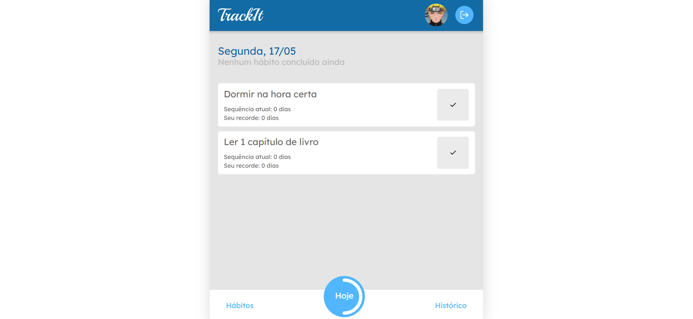

# 
# App para gerenciamento de hábitos
### Criado na semana 10 do bootcamp Responde Aí
## Tecnologias Utilizadas:
|HTML|CSS|JavaScript|ReactJS|
|-|-|-|-|
|||||
|Sintaxe JSX|Utilizado na estilização das páginas e dos componentes com styled components|Aplicação das funcionalidades com o Framework React|Recursos Utilizados: Function Components, React Router DOM, React Hooks|
___
[Clique aqui](https://cineflex-two.vercel.app/) para acessar o App
___

